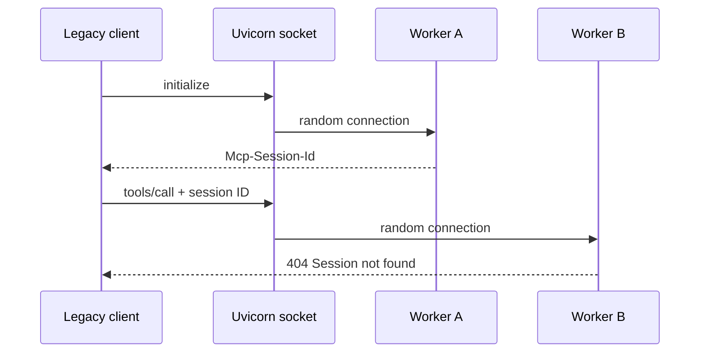
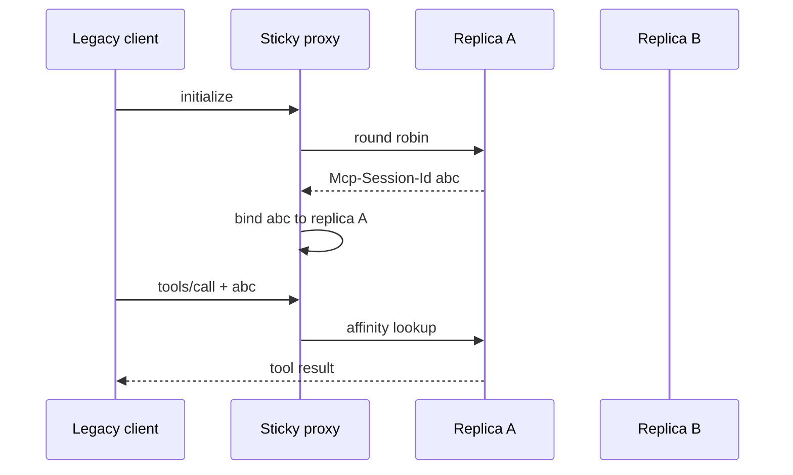
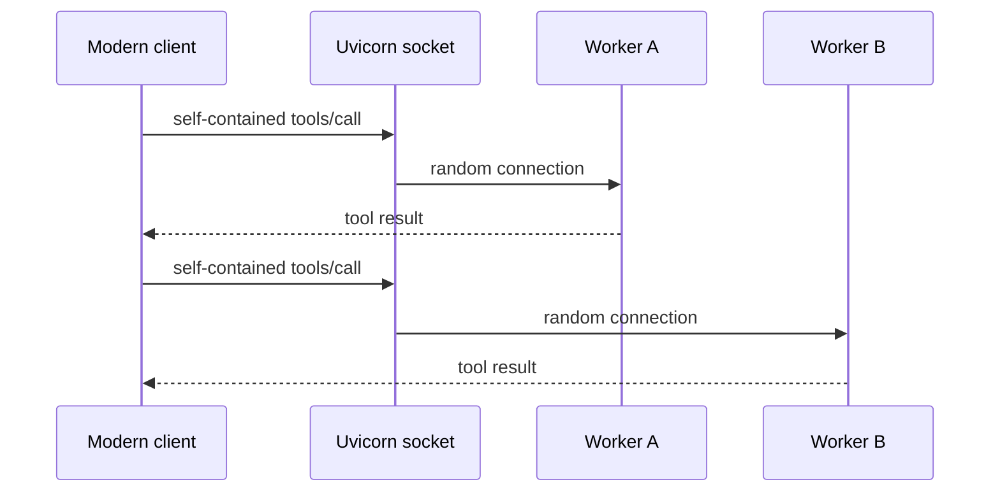
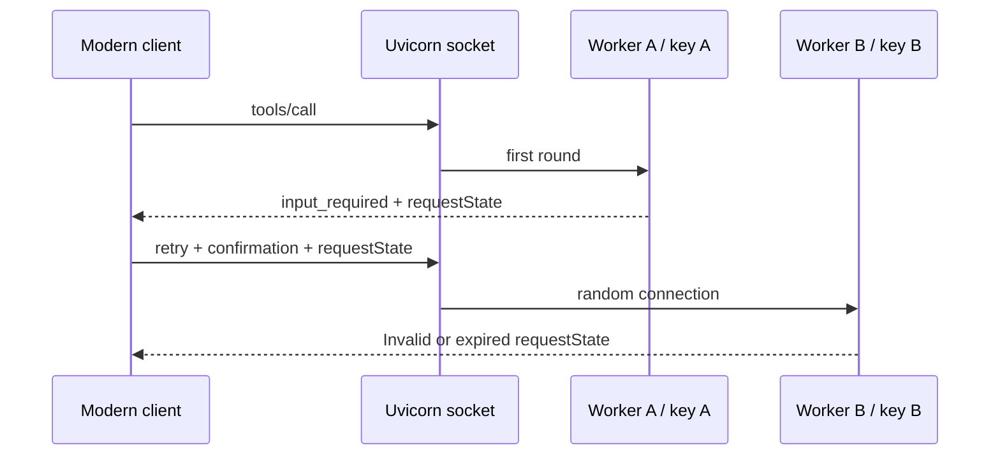
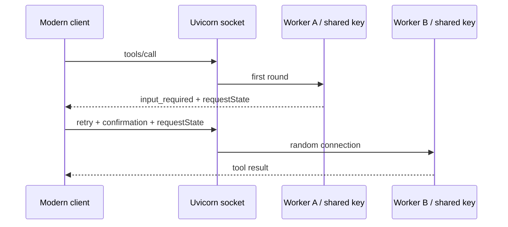

# MCP Stateless by Design

A reproducible multi-worker lab comparing handshake-era MCP (through
`2025-11-25`) with stateless MCP `2026-07-28`.

The central idea is simple:

> MCP removed implicit protocol session state. Applications and distributed
> workflows may still require explicit state and coordination.

## What the repository demonstrates

Legacy MCP creates a session during `initialize`. A later request carrying its
`Mcp-Session-Id` must reach a worker that knows that session. Modern MCP puts
the protocol context in every request, so ordinary tool calls can reach any
worker. Uvicorn workers are separate processes and do not share memory.

Modern multi-round-trip requests (MRTR) remain coordinated by an opaque
`requestState`. The protocol is stateless, but every worker must be able to
verify that token.

| # | Experiment | Expected observation |
|---|---|---|
| 1 | Legacy, random routing | Intermittent `Session not found` |
| 2 | Legacy, sticky routing | All sessions succeed, but the proxy stores affinity |
| 3 | Modern, random routing | All independent calls succeed without sessions |
| 4 | Modern MRTR, ephemeral keys | Cross-worker retries reject `requestState` |
| 5 | Modern MRTR, shared key | Cross-worker retries succeed without affinity |

The demo command returns success when the expected behavior is observed. In
scenarios 1 and 4, that means seeing both successful and failed attempts.

## Run the experiments

Requirements: [uv](https://docs.astral.sh/uv/) and `make`.

```console
make install
```

Each experiment uses two terminals. Start its server in the first terminal and
run its demo in the second:

| # | Server | Demo |
|---|---|---|
| 1 | `make serve-legacy-multiworker` | `make demo-legacy-multiworker` |
| 2 | `make serve-sticky-session` | `make demo-sticky-session` |
| 3 | `make serve-modern-multiworker` | `make demo-modern-stateless` |
| 4 | `make serve-mrtr-ephemeral-keys` | `make demo-mrtr-ephemeral-keys` |
| 5 | `make serve-mrtr-shared-key` | `make demo-mrtr-shared-key` |

Each demo runs 80 attempts and prints worker PIDs plus a final verdict. Scenarios
1 and 2 also accept `--verbose` on their Python modules for the full legacy MCP
exchange.

```console
uv run python -m mcp_stateless.legacy.multi_worker --verbose
uv run python -m mcp_stateless.legacy.sticky_session --verbose
```

## 1. Legacy multi-worker failure

Each attempt opens an independent legacy client. Entering the client context
implicitly sends `initialize` and `notifications/initialized`; the subsequent
tool call may be routed to another Uvicorn worker.



The failure is intentionally intermittent: a tool call succeeds when it returns
to the worker that created the session and fails otherwise. The ratio is not a
benchmark.

## 2. Legacy sticky session

Two addressable replicas sit behind a proxy. The proxy distributes new sessions
round-robin, then maps each `Mcp-Session-Id` to its original replica.



All sessions succeed, but the load balancer now owns MCP-specific routing state.

## 3. Modern stateless

The client pins MCP `2026-07-28`. There is no handshake and no
`Mcp-Session-Id`; every `tools/call` carries the protocol context required by
the receiving worker.



The demo requires multiple workers, zero `initialize` requests, zero session
headers, and no failed calls. It also reports the SDK's cacheable `tools/list`
schema lookup separately.

## 4. MRTR with ephemeral worker keys

The modern `provision_environment` tool uses elicitation to ask for confirmation.
The SDK returns `input_required` with a protected `requestState`, then the client
retries the same tool call with the confirmation and token.

By default, every server process generates its own request-state key.



Same-worker retries succeed. Cross-worker retries fail because another process
cannot verify the token.

## 5. MRTR with a shared worker key

The tool and client are unchanged. Every worker now receives the same
`RequestStateSecurity` key and audience.



The demo passes only when every interaction succeeds and at least one successful
retry crosses worker boundaries. The Makefile key is for local demonstration
only; production deployments must load secret key material securely and define
a rotation policy.

## Code map

```text
src/mcp_stateless/
|-- echo_server.py          # tool shared by scenarios 1-3
|-- worker_pid.py           # exposes the serving PID
|-- legacy/                 # initialize and Mcp-Session-Id
|   |-- client.py
|   |-- multi_worker.py
|   |-- sticky_proxy.py
|   `-- sticky_session.py
`-- modern/                 # MCP 2026-07-28
    |-- stateless.py
    |-- mrtr_client.py
    |-- mrtr_server.py
    |-- mrtr_ephemeral_keys.py
    |-- mrtr_shared_key.py
    `-- mrtr_shared_key_server.py
```

Run formatting, linting, strict type checking, and tests with:

```console
make check
```
