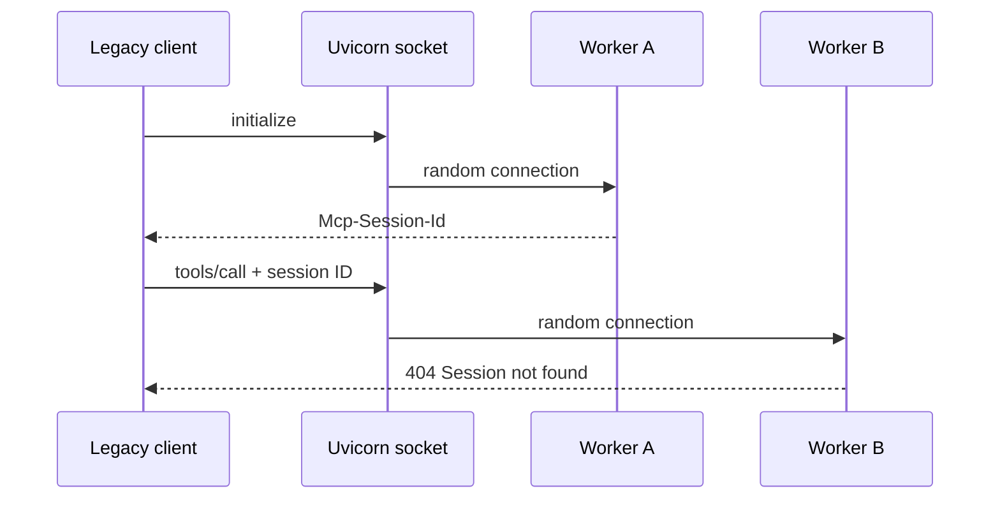
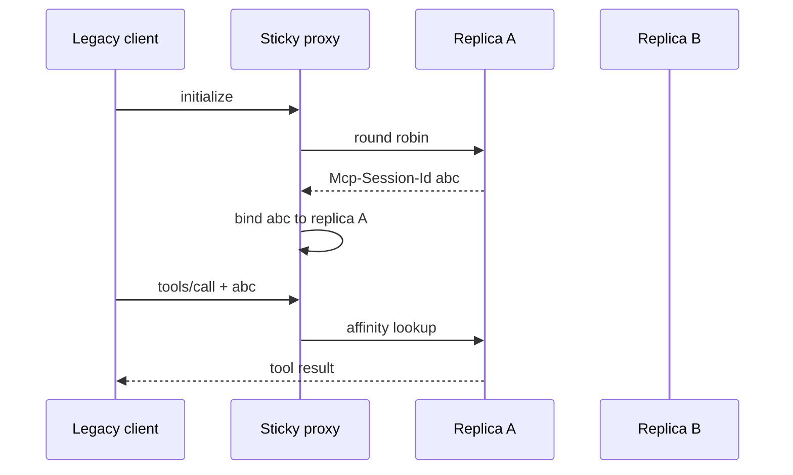
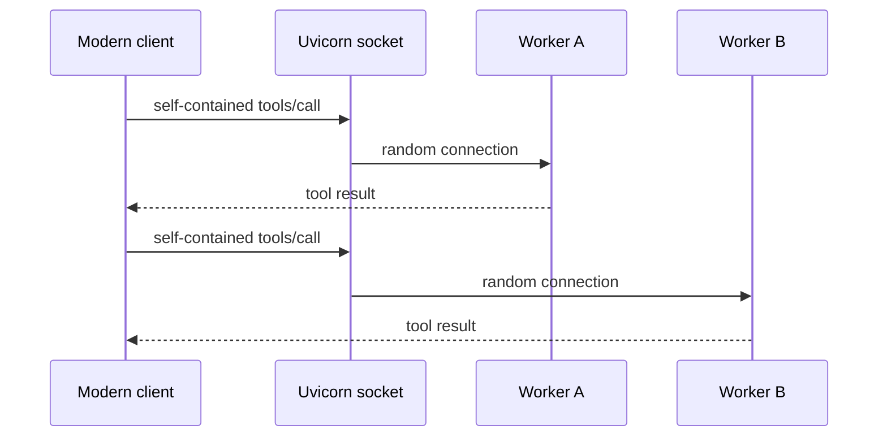
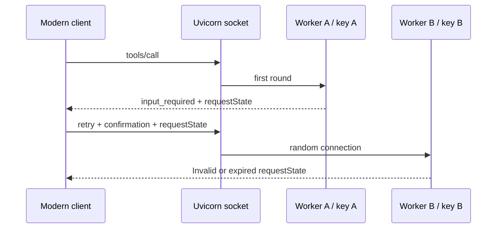
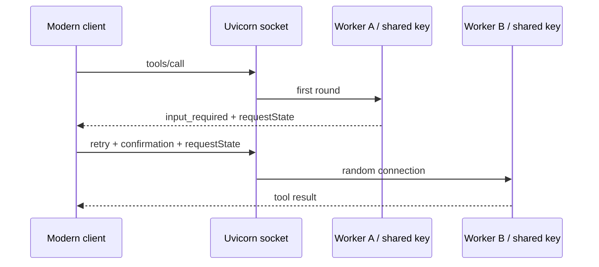

# MCP Stateless by Design

A reproducible multi-worker lab comparing handshake-era MCP (through
`2025-11-25`) with stateless MCP `2026-07-28`.

The central idea is simple:

> MCP removed implicit protocol session state. Applications and distributed
> workflows may still require explicit state and coordination.

## What the repository demonstrates

The five experiments tell one progressive story.

### 1. Legacy MCP couples a client session to one worker

Handshake-era MCP starts with `initialize`. The worker stores the negotiated
protocol state and returns an `Mcp-Session-Id`, which every later request must
carry. Uvicorn workers are separate processes, so a tool call routed to a
different worker intermittently fails with `Session not found`.

### 2. Legacy deployments use session affinity

A proxy can remember which replica created each session and keep its later
requests on that replica. This removes the intermittent failures, but makes the
infrastructure responsible for MCP-aware routing state and constrains scaling,
failover, and restarts.

### 3. Modern MCP makes ordinary tool calls worker-independent

Modern MCP removes the handshake and protocol session ID. Each independent
request carries the protocol context needed to process it, so a one-round
`tools/call` can reach any worker. This removes protocol-level session
affinity; it does not remove application state from stateful tools.

### 4. Multi-round workflows require explicit coordination

Some operations cannot finish in one request. For example, a tool may need to
ask the user for confirmation through elicitation. With
[multi-round-trip requests (MRTR)](https://modelcontextprotocol.io/seps/2322-MRTR),
the first round returns an opaque `requestState`; after collecting the input,
the client retries the same logical operation with that token. These are two
independently routed HTTP requests.

The Python SDK protects `requestState` cryptographically. With its default
per-process ephemeral key, a token created by one worker cannot be verified by
another. This is a new coordination boundary, not the return of an implicit
legacy session.

### 5. Stateless still requires deliberate coordination

All replicas can share the key and audience used to protect `requestState`.
Any worker can then continue the operation without affinity or shared protocol
session storage. The application developer still owns secure key distribution,
consistent configuration, rotation, and any persistent domain state. Stateless
means that coordination is explicit; it does not mean that coordination
disappears.

| # | Experiment | Expected observation |
|---|---|---|
| 1 | Legacy, random routing | Intermittent `Session not found` |
| 2 | Legacy, sticky routing | All sessions succeed, but the proxy stores affinity |
| 3 | Modern, random routing | All independent calls succeed without sessions |
| 4 | Modern MRTR, ephemeral keys | Cross-worker retries reject `requestState` |
| 5 | Modern MRTR, shared key | Cross-worker retries succeed without affinity |

The demo command returns success when the expected behavior is observed. In
scenarios 1 and 4, that means seeing both successful and failed attempts.

## Run the experiments

Requirements: [uv](https://docs.astral.sh/uv/) and `make`.

```console
make install
```

Each experiment uses two terminals. Start its server in the first terminal and
run its demo in the second:

| # | Server | Demo |
|---|---|---|
| 1 | `make serve-legacy-multiworker` | `make demo-legacy-multiworker` |
| 2 | `make serve-sticky-session` | `make demo-sticky-session` |
| 3 | `make serve-modern-multiworker` | `make demo-modern-stateless` |
| 4 | `make serve-mrtr-ephemeral-keys` | `make demo-mrtr-ephemeral-keys` |
| 5 | `make serve-mrtr-shared-key` | `make demo-mrtr-shared-key` |

Each demo runs 80 attempts and prints worker PIDs plus a final verdict. Scenarios
1 and 2 also accept `--verbose` on their Python modules for the full legacy MCP
exchange.

```console
uv run python -m mcp_stateless.legacy.multi_worker --verbose
uv run python -m mcp_stateless.legacy.sticky_session --verbose
```

## 1. Legacy multi-worker failure

Each attempt opens an independent legacy client. Entering the client context
implicitly sends `initialize` and `notifications/initialized`; the subsequent
tool call may be routed to another Uvicorn worker.



The failure is intentionally intermittent: a tool call succeeds when it returns
to the worker that created the session and fails otherwise. The ratio is not a
benchmark.

## 2. Legacy sticky session

Two addressable replicas sit behind a proxy. The proxy distributes new sessions
round-robin, then maps each `Mcp-Session-Id` to its original replica.



All sessions succeed, but the load balancer now owns MCP-specific routing state.

## 3. Modern stateless

The client pins MCP `2026-07-28`. There is no handshake and no
`Mcp-Session-Id`; every `tools/call` carries the protocol context required by
the receiving worker.



The demo requires multiple workers, zero `initialize` requests, zero session
headers, and no failed calls. It also reports the SDK's cacheable `tools/list`
schema lookup separately.

## 4. MRTR with ephemeral worker keys

The modern `provision_environment` tool uses elicitation to ask for confirmation.
The SDK returns `input_required` with a protected `requestState`, then the client
retries the same tool call with the confirmation and token.

By default, every server process generates its own request-state key.



Same-worker retries succeed. Cross-worker retries fail because another process
cannot verify the token.

## 5. MRTR with a shared worker key

The tool and client are unchanged. Every worker now receives the same
`RequestStateSecurity` key and audience.



The demo passes only when every interaction succeeds and at least one successful
retry crosses worker boundaries. The Makefile key is for local demonstration
only; production deployments must load secret key material securely and define
a rotation policy.