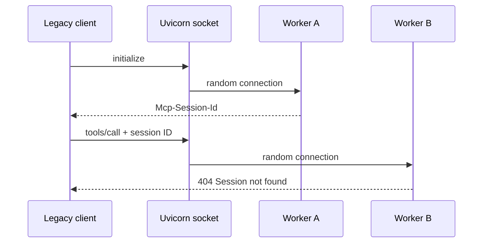
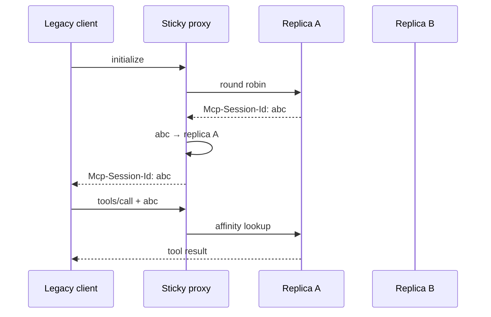
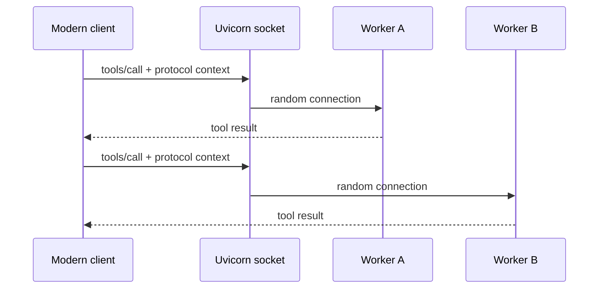
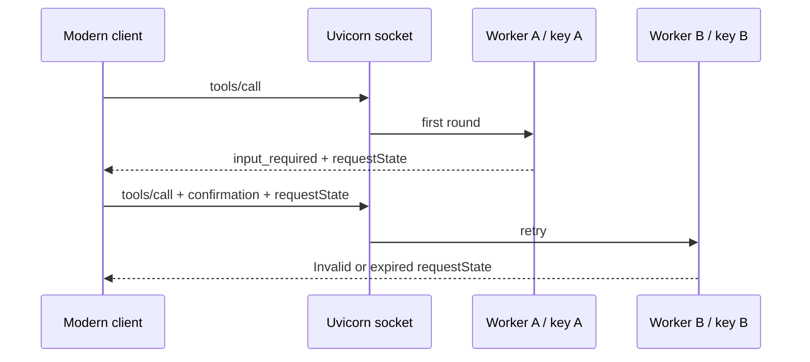
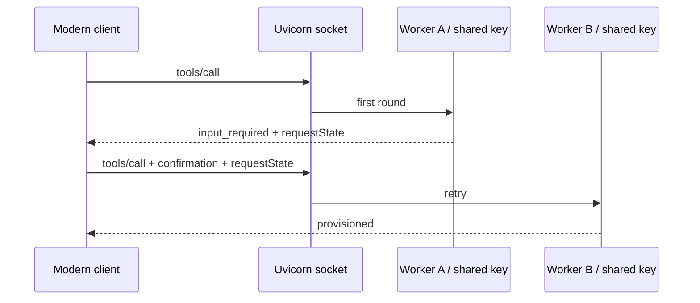

# MCP Stateless by Design

A reproducible multi-worker lab showing that MCP removed implicit protocol
session state, not the need to design application and coordination state.

## 1. Legacy multi-worker failure

Uvicorn workers share a listening socket but keep independent MCP session
stores. The demo opens 80 independent legacy sessions; each attempt performs
`initialize` followed by a tool call over separately routed HTTP connections.



Start the four-worker server:

```console
make install
make serve-legacy-multiworker
```

In another terminal, run the scenario:

```console
make demo-legacy-multiworker
```

Every exchange prints its worker PID, HTTP status, JSON-RPC method, and session
ID. The command succeeds only when multiple workers handled requests and the
run produced both successful sessions and real `Session not found` failures.
The experiment makes the failure intermittent and routing-dependent, rather
than measuring a meaningful failure rate.

## 2. Legacy sticky session

The proxy distributes new sessions across two addressable replicas, then stores
their affinity. Every request carrying the same `Mcp-Session-Id` returns to the
replica that created it.



Start both replicas and the proxy:

```console
make serve-sticky-session
```

In another terminal, run the scenario:

```console
make demo-sticky-session
```

The default output shows one compact row per session and a final verdict. Use
`uv run python -m mcp_stateless.scenarios.sticky_session --verbose` to inspect
every MCP exchange.

The same 80 independent sessions now use both replicas without crossing worker
boundaries or producing `Session not found`. Affinity removes the intermittent
failure, but makes the proxy responsible for MCP-specific routing state.

## 3. Modern stateless

With MCP `2026-07-28`, every tool call carries its protocol context. Requests
can reach any worker without initialization, session IDs, or affinity.



Start the four-worker server:

```console
make serve-modern-multiworker
```

In another terminal, run the scenario:

```console
make demo-modern-stateless
```

The demo sends 80 self-contained `tools/call` requests and passes only when
multiple workers handle them all successfully, with zero `initialize` requests
and zero `Mcp-Session-Id` headers. The summary also exposes the SDK's cacheable
`tools/list` schema lookup. The load balancer needs no MCP-specific routing
state.

## 4. MRTR with ephemeral worker keys

A modern tool asks the client to confirm a costly operation. The first round
returns an elicitation and a `requestState` protected by the worker's default
ephemeral key. A retry routed to another worker cannot verify that token.



Start the four-worker server:

```console
make serve-mrtr-ephemeral-keys
```

In another terminal, run the scenario:

```console
make demo-mrtr-ephemeral-keys
```

The demo runs 80 real two-round interactions. Same-worker retries succeed;
cross-worker retries fail intermittently because each process generated a
different key. MCP removed protocol sessions, but `requestState` still requires
coordination across replicas.

## 5. MRTR with a shared worker key

The tool and client are unchanged. Each worker now receives the same
`RequestStateSecurity` key and audience, so any replica can verify a retry.



Start the four-worker server:

```console
make serve-mrtr-shared-key
```

In another terminal, run the scenario:

```console
make demo-mrtr-shared-key
```

The demo passes only when all 80 interactions succeed and at least one retry
crosses worker boundaries. The Makefile supplies a fixed demo key; production
deployments must load key material securely and define a rotation policy.
