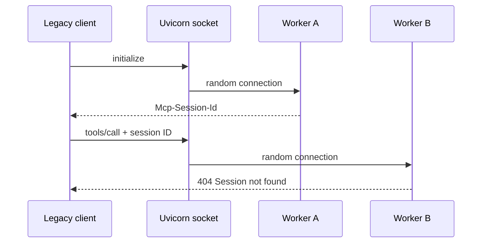

# MCP Stateless by Design

A reproducible multi-worker lab showing that MCP removed implicit protocol
session state, not the need to design application and coordination state.

## Legacy multi-worker failure

Uvicorn workers share a listening socket but keep independent MCP session
stores. The demo opens 80 independent legacy sessions; each attempt performs
`initialize` followed by a tool call over separately routed HTTP connections.



Start the four-worker server:

```console
make install
make serve
```

In another terminal, run the scenario:

```console
make demo-legacy-multiworker
```

Every exchange prints its worker PID, HTTP status, JSON-RPC method, and session
ID. The command succeeds only when multiple workers handled requests and the
run produced both successful sessions and real `Session not found` failures.
The experiment makes the failure intermittent and routing-dependent, rather
than measuring a meaningful failure rate.
