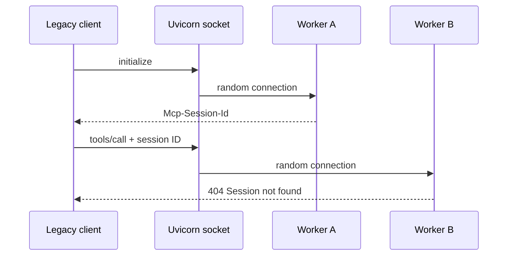
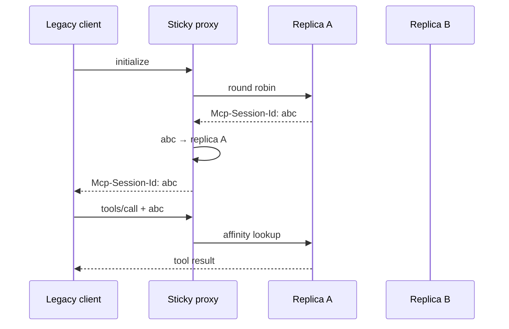

# MCP Stateless by Design

A reproducible multi-worker lab showing that MCP removed implicit protocol
session state, not the need to design application and coordination state.

## 1. Legacy multi-worker failure

Uvicorn workers share a listening socket but keep independent MCP session
stores. The demo opens 80 independent legacy sessions; each attempt performs
`initialize` followed by a tool call over separately routed HTTP connections.



Start the four-worker server:

```console
make install
make serve-legacy-multiworker
```

In another terminal, run the scenario:

```console
make demo-legacy-multiworker
```

Every exchange prints its worker PID, HTTP status, JSON-RPC method, and session
ID. The command succeeds only when multiple workers handled requests and the
run produced both successful sessions and real `Session not found` failures.
The experiment makes the failure intermittent and routing-dependent, rather
than measuring a meaningful failure rate.

## 2. Legacy sticky session

The proxy distributes new sessions across two addressable replicas, then stores
their affinity. Every request carrying the same `Mcp-Session-Id` returns to the
replica that created it.



Start both replicas and the proxy:

```console
make serve-sticky-session
```

In another terminal, run the scenario:

```console
make demo-sticky-session
```

The default output shows one compact row per session and a final verdict. Use
`uv run python -m mcp_stateless.scenarios.sticky_session --verbose` to inspect
every MCP exchange.

The same 80 independent sessions now use both replicas without crossing worker
boundaries or producing `Session not found`. Affinity removes the intermittent
failure, but makes the proxy responsible for MCP-specific routing state.
